# Education Malaysia — Production-Grade React Architecture Plan

> **Goal:** Transform the current flat, monolithic React frontend into a scalable, modular, enterprise-level architecture without breaking ANY existing routes, URLs, designs, or functionality. Also improve performance significantly.

---

## ✅ User Decisions

- **Scope:** Refactor ALL files at once (full migration)
- **File renaming:** YES - Fix all typos (Grdadute → Graduate, Regstation → Registration, GetinTouchinExam → GetInTouchExam)
- **Form consolidation:** YES - Merge 3 GetInTouch variants into one configurable component (after verifying form types/values match)
- **Priority:** Complete refactoring
- **Performance:** High priority - optimize for better Lighthouse scores

---

## Current State Analysis

### Codebase Stats
| Metric | Value |
|---|---|
| Total Routes | 45+ |
| Files > 1000 lines | 6 |
| Files > 500 lines | 12+ |
| Largest file | `Courses.jsx` — **2,766 lines (133 KB)** |
| Existing services | 2 files (`courseService.js`, `partnerService.js`) |
| Existing utils | 4 files |
| Lazy loading | ✅ Already in `App.jsx` |
| Code splitting (vendor) | ✅ Already in `vite.config.js` |

### Critical Problem Files (sorted by size)

| File | Lines | KB | Mixed Concerns |
|---|---|---|---|
| [Courses.jsx](file:///d:/Education-malaysia/src/pages/Courses.jsx) | 2,766 | 133 | API calls, filters, search, sort, compare, skeletons, cards, modals |
| [UniversityDetail.jsx](file:///d:/Education-malaysia/src/pages/universitysection/UniversityDetail.jsx) | 2,069 | 70 | 10+ tabs, API, images, reviews, courses, popups |
| [ContactTeam.jsx](file:///d:/Education-malaysia/src/pages/OurPartners/ContactTeam.jsx) | ~1,800 | 68 | Forms, validation, API, UI |
| [Courses2.jsx](file:///d:/Education-malaysia/src/pages/universitysection/Courses2.jsx) | ~1,500 | 56 | Duplicate/ variant of Courses |
| [universitypopform.jsx](file:///d:/Education-malaysia/src/pages/universitysection/universitypopform.jsx) | ~1,400 | 53 | Large popup form with business logic |
| [Partners.jsx](file:///d:/Education-malaysia/src/pages/OurPartners/Partners.jsx) | 1,145 | 50 | Partner listing + filters + modals |
| [PartnerApplicationForm.jsx](file:///d:/Education-malaysia/src/pages/OurPartners/PartnerApplicationForm.jsx) | ~1,300 | 49 | Long form with validation |
| [SpecializationDetail.jsx](file:///d:/Education-malaysia/src/pages/SpecializationDetail.jsx) | 1,241 | 48 | API, tabs, HTML formatting, categories |
| [AdditionalQualifications.jsx](file:///d:/Education-malaysia/src/pages/Regstation/AdditionalQualifications.jsx) | ~1,200 | 46 | Registration form |
| [UniversitiesList.jsx](file:///d:/Education-malaysia/src/pages/universitysection/UniversitiesList.jsx) | ~1,200 | 46 | List + filters + pagination |
| [Profile.jsx](file:///d:/Education-malaysia/src/pages/Regstation/Profile.jsx) | ~1,100 | 44 | Student profile + forms |
| [Universities.jsx](file:///d:/Education-malaysia/src/pages/universitysection/Universities.jsx) | ~1,100 | 43 | University search + filters |

### Identified Anti-Patterns
1. **God Components** — Single files doing API calls, state management, filtering, rendering, modals, forms
2. **No service layer** — API calls embedded in every page component's `useEffect`
3. **Duplicate logic** — Multiple "GetInTouch" form variants (`GetInTouchForm.jsx`, `GetinTouchUiversity.jsx`, `GetinTouchinExam.jsx`)
4. **Inline skeletons** — Loading states defined inside page components
5. **Mixed form logic** — Validation, submission, and UI all in one file
6. **No custom hooks** — Zero `hooks/` directory; all stateful logic is inline
7. **No constants file** — Magic strings and config scattered everywhere

---

## STEP 1: New Production Folder Architecture

```
src/
├── app/                          # App shell & routing
│   ├── App.jsx                   # Root component (unchanged routes)
│   ├── routes.jsx                # Route definitions extracted
│   └── providers.jsx             # Context providers wrapper
│
├── layouts/                      # Page layout wrappers
│   ├── MainLayout.jsx            # Navbar + Footer + ScrollToTop + WhatsApp
│   └── StudentLayout.jsx         # Auth-protected layout for /student/*
│
├── pages/                        # Page-level containers (THIN — orchestrate only)
│   ├── home/
│   │   └── HomePage.jsx
│   ├── universities/
│   │   ├── UniversitiesPage.jsx
│   │   ├── UniversitiesListPage.jsx
│   │   └── UniversityDetailPage.jsx
│   ├── courses/
│   │   ├── CoursesPage.jsx
│   │   └── CourseDetailPage.jsx
│   ├── specializations/
│   │   ├── SpecializationPage.jsx
│   │   └── SpecializationDetailPage.jsx
│   ├── scholarships/
│   │   ├── ScholarshipPage.jsx
│   │   └── ScholarshipDetailPage.jsx
│   ├── resources/
│   │   ├── ExamPage.jsx
│   │   ├── ExamDetailPage.jsx
│   │   ├── ServicesPage.jsx
│   │   ├── ServiceDetailPage.jsx
│   │   ├── ServiceVisaPage.jsx
│   │   ├── ServiceAdmissionPage.jsx
│   │   ├── ServiceDiscoverPage.jsx
│   │   ├── GraduatePassPage.jsx
│   │   └── MQAPage.jsx
│   ├── about/
│   │   ├── WhoWeArePage.jsx
│   │   ├── WhatStudentsSayPage.jsx
│   │   ├── WhyStudyPage.jsx
│   │   └── TeamPage.jsx
│   ├── partners/
│   │   └── PartnersPage.jsx
│   ├── blog/
│   │   ├── BlogPage.jsx
│   │   └── BlogDetailPage.jsx
│   ├── student/
│   │   ├── ProfilePage.jsx
│   │   ├── OverviewPage.jsx
│   │   ├── AppliedCollegesPage.jsx
│   │   ├── ConversationPage.jsx
│   │   └── ChangePasswordPage.jsx
│   ├── auth/
│   │   ├── LoginPage.jsx
│   │   ├── SignUpPage.jsx
│   │   ├── ResetPasswordPage.jsx
│   │   └── ConfirmedEmailPage.jsx
│   ├── legal/
│   │   ├── TermsPage.jsx
│   │   ├── PrivacyPolicyPage.jsx
│   │   └── FaqsPage.jsx
│   ├── qualification/
│   │   ├── SelectLevelPage.jsx
│   │   └── LevelDetailPage.jsx
│   └── NotFoundPage.jsx
│
├── features/                     # Feature-based modules (domain logic)
│   ├── courses/
│   │   ├── components/
│   │   │   ├── CourseCard.jsx
│   │   │   ├── CourseCardSkeleton.jsx
│   │   │   ├── CourseFilterPanel.jsx
│   │   │   ├── CourseFilterSkeleton.jsx
│   │   │   ├── CourseSearchBar.jsx
│   │   │   ├── CourseSortDropdown.jsx
│   │   │   ├── CourseCompareBar.jsx
│   │   │   └── CourseCompareModal.jsx
│   │   ├── hooks/
│   │   │   ├── useCourseFilters.js
│   │   │   ├── useCourseSearch.js
│   │   │   ├── useCoursePagination.js
│   │   │   └── useCourseCompare.js
│   │   └── services/
│   │       └── courseApi.js
│   │
│   ├── universities/
│   │   ├── components/
│   │   │   ├── UniversityCard.jsx
│   │   │   ├── UniversityInfoBoxes.jsx
│   │   │   ├── UniversityActionButtons.jsx
│   │   │   ├── UniversityTabs.jsx
│   │   │   ├── UniversityGallery.jsx
│   │   │   ├── UniversityRanking.jsx
│   │   │   ├── UniversityFilterPanel.jsx
│   │   │   └── UniversitySkeleton.jsx
│   │   ├── hooks/
│   │   │   ├── useUniversityData.js
│   │   │   └── useUniversityFilters.js
│   │   └── services/
│   │       └── universityApi.js
│   │
│   ├── partners/
│   │   ├── components/
│   │   │   ├── PartnerCard.jsx
│   │   │   ├── PartnerFilterBar.jsx
│   │   │   └── PartnerContactModal.jsx
│   │   ├── hooks/
│   │   │   └── usePartnerData.js
│   │   └── services/
│   │       └── partnerApi.js
│   │
│   ├── specializations/
│   │   ├── components/
│   │   │   ├── SpecializationCard.jsx
│   │   │   ├── SpecializationTabs.jsx
│   │   │   └── SpecializationSkeleton.jsx
│   │   ├── hooks/
│   │   │   └── useSpecializationData.js
│   │   └── services/
│   │       └── specializationApi.js
│   │
│   └── auth/
│       ├── components/
│       │   ├── LoginForm.jsx
│       │   ├── SignUpForm.jsx
│       │   ├── OTPModal.jsx
│       │   └── AuthModal.jsx
│       ├── hooks/
│       │   └── useAuth.js
│       └── services/
│           └── authApi.js
│
├── components/                   # Shared UI components (reusable across features)
│   ├── ui/                       # Atomic UI primitives
│   │   ├── Button.jsx
│   │   ├── Input.jsx
│   │   ├── Select.jsx
│   │   ├── Modal.jsx
│   │   ├── Skeleton.jsx
│   │   ├── Badge.jsx
│   │   ├── Card.jsx
│   │   ├── Pagination.jsx
│   │   └── Spinner.jsx
│   ├── forms/                    # Reusable form patterns
│   │   ├── GetInTouchForm.jsx    # ← SINGLE consolidated form
│   │   ├── ContactFormPopup.jsx
│   │   ├── ApplicationModal.jsx
│   │   └── PopupForm.jsx
│   ├── seo/                      # SEO-related
│   │   ├── SeoHead.jsx
│   │   └── DynamicBreadcrumb.jsx
│   ├── navigation/               # Navigation elements
│   │   ├── Navbar.jsx
│   │   ├── Footer.jsx
│   │   ├── ScrollToTop.jsx
│   │   └── ScrollToTopButton.jsx
│   └── common/                   # Shared display components
│       ├── FeaturedUniversities.jsx
│       ├── TrendingCourses.jsx
│       ├── WhatsAppButton.jsx
│       ├── LoadingFallback.jsx
│       └── ExpandableCard.jsx
│
├── hooks/                        # Shared custom hooks
│   ├── useDebounce.js
│   ├── usePagination.js
│   ├── useIntersectionObserver.js
│   ├── useMediaQuery.js
│   └── useScrollLock.js
│
├── services/                     # API layer (centralized)
│   ├── api.js                    # Axios instance + interceptors
│   ├── seoService.js
│   └── endpoints.js              # API URL constants
│
├── utils/                        # Pure utility functions
│   ├── formatters.js             # Date, number, URL formatters
│   ├── validators.js             # Form validation logic
│   ├── htmlHelpers.js            # HTML parsing/formatting
│   └── slugHelpers.js            # URL slug utilities
│
├── constants/                    # App-wide constants
│   ├── routes.js                 # Route path constants
│   ├── filterOptions.js          # Static filter/sort options
│   └── config.js                 # Environment config
│
├── context/                      # React Context providers
│   ├── AuthContext.jsx
│   └── AppContext.jsx
│
├── styles/                       # Global styles
│   └── index.css
│
├── config.js                     # API base URL config
└── main.jsx                      # Entry point
```

### Key Architectural Principles

1. **Feature-based modules** — Each domain (courses, universities, partners) owns its components, hooks, and API services
2. **Thin pages** — Pages only *compose* feature components and handle route params. No business logic.
3. **Service layer** — All `axios` / `api.get()` calls move to `services/` or `features/*/services/`
4. **Custom hooks** — Stateful logic extracted into reusable hooks
5. **Shared UI** — Atomic components in `components/ui/` used everywhere
6. **One form, one job** — Consolidate GetInTouch form variants into one configurable component

---

## STEP 2: How to Split a 3000-Line File

Using `Courses.jsx` (2,766 lines) as the reference model:

### Split Strategy (Layer Cake Method)

```mermaid
graph TD
    A["Courses.jsx<br/>2,766 lines"] --> B["CoursesPage.jsx<br/>~100 lines<br/>THIN ORCHESTRATOR"]
    A --> C["courseApi.js<br/>~80 lines<br/>SERVICE LAYER"]
    A --> D["useCourseFilters.js<br/>~150 lines<br/>HOOK"]
    A --> E["useCourseSearch.js<br/>~50 lines<br/>HOOK"]
    A --> F["useCoursePagination.js<br/>~40 lines<br/>HOOK"]
    A --> G["useCourseCompare.js<br/>~50 lines<br/>HOOK"]
    A --> H["CourseCard.jsx<br/>~120 lines<br/>COMPONENT"]
    A --> I["CourseFilterPanel.jsx<br/>~200 lines<br/>COMPONENT"]
    A --> J["CourseSearchBar.jsx<br/>~50 lines<br/>COMPONENT"]
    A --> K["CourseSortDropdown.jsx<br/>~60 lines<br/>COMPONENT"]
    A --> L["CourseCompareBar.jsx<br/>~80 lines<br/>COMPONENT"]
    A --> M["CourseCardSkeleton.jsx<br/>~30 lines<br/>UI COMPONENT"]
    A --> N["CourseFilterSkeleton.jsx<br/>~20 lines<br/>UI COMPONENT"]
```



### The 5-Layer Extraction Process

#### Layer 1: Extract API Calls → `services/`

**BEFORE** (inside component):
```jsx
// Inside Courses component, 60+ lines of API logic
const fetchCourses = async (page = 1, filtersToApply = {}, searchTerm = "") => {
  setIsLoading(true);
  try {
    const params = new URLSearchParams();
    params.append("page", page);
    // ... 50 more lines building params
    const response = await api.get(`/courses?${params.toString()}`);
    setCourses(response.data.courses.data);
    // ... more state updates
  } catch (error) {
    console.error("Error:", error);
  }
};
```

**AFTER** → `features/courses/services/courseApi.js`:
```jsx
import api from '../../../services/api';

export const fetchCourses = async ({ page = 1, filters = {}, search = '' }) => {
  const params = new URLSearchParams();
  params.append('page', page);
  Object.entries(filters).forEach(([key, value]) => {
    if (value) params.append(key, value);
  });
  if (search) params.append('search', search);
  const { data } = await api.get(`/courses?${params.toString()}`);
  return data;
};

export const fetchFilterOptions = async (filters = {}) => {
  const { data } = await api.get('/courses/filters', { params: filters });
  return data;
};

export const fetchDynamicDescription = async (filterType, filterId) => {
  const { data } = await api.get(`/courses/description/${filterType}/${filterId}`);
  return data;
};
```

#### Layer 2: Extract Stateful Logic → `hooks/`

**AFTER** → `features/courses/hooks/useCourseFilters.js`:
```jsx
import { useState, useCallback, useEffect } from 'react';
import { useNavigate, useParams } from 'react-router-dom';
import { fetchFilterOptions } from '../services/courseApi';

export function useCourseFilters() {
  const [filters, setFilters] = useState({});
  const [filterOptions, setFilterOptions] = useState({});
  const [openSections, setOpenSections] = useState({});
  const navigate = useNavigate();

  const handleFilterChange = useCallback((filterType, value) => {
    setFilters(prev => {
      const updated = { ...prev, [filterType]: value };
      // URL building logic
      return updated;
    });
  }, [navigate]);

  const handleReset = useCallback(() => {
    setFilters({});
    navigate('/courses-in-malaysia');
  }, [navigate]);

  const toggleFilter = useCallback((key) => {
    setOpenSections(prev => ({ ...prev, [key]: !prev[key] }));
  }, []);

  return { filters, filterOptions, openSections, handleFilterChange, handleReset, toggleFilter };
}
```

#### Layer 3: Extract Presentational Components → `components/`

**AFTER** → `features/courses/components/CourseCard.jsx`:
```jsx
import React from 'react';
import { Link } from 'react-router-dom';
import { Clock, Calendar, DollarSign, Award } from 'lucide-react';

const CourseCard = React.memo(({ course, onApply, onCompare, isCompared }) => (
  <div className="course-card">
    <h3>{course.name}</h3>
    <div className="course-meta">
      <span><Clock size={14} /> {course.duration}</span>
      <span><DollarSign size={14} /> {course.fee}</span>
    </div>
    <div className="course-actions">
      <Link to={course.detailUrl}>View Details</Link>
      <button onClick={() => onApply(course)}>Apply Now</button>
      <button onClick={() => onCompare(course)}>
        {isCompared ? 'Remove' : 'Compare'}
      </button>
    </div>
  </div>
));

export default CourseCard;
```

#### Layer 4: Extract Skeletons → `ui/`

**AFTER** → `features/courses/components/CourseCardSkeleton.jsx`:
```jsx
const CourseCardSkeleton = () => (
  <div className="animate-pulse rounded-xl border p-4">
    <div className="h-4 bg-gray-200 rounded w-3/4 mb-3" />
    <div className="h-3 bg-gray-200 rounded w-1/2 mb-2" />
    <div className="h-3 bg-gray-200 rounded w-1/3" />
  </div>
);

export default CourseCardSkeleton;
```

#### Layer 5: Compose in Thin Page → `pages/`

**AFTER** → `pages/courses/CoursesPage.jsx`:
```jsx
import React from 'react';
import SeoHead from '../../components/seo/SeoHead';
import DynamicBreadcrumb from '../../components/seo/DynamicBreadcrumb';
import CourseFilterPanel from '../../features/courses/components/CourseFilterPanel';
import CourseSearchBar from '../../features/courses/components/CourseSearchBar';
import CourseSortDropdown from '../../features/courses/components/CourseSortDropdown';
import CourseCard from '../../features/courses/components/CourseCard';
import CourseCompareBar from '../../features/courses/components/CourseCompareBar';
import CourseCardSkeleton from '../../features/courses/components/CourseCardSkeleton';
import { useCourseFilters } from '../../features/courses/hooks/useCourseFilters';
import { useCourseSearch } from '../../features/courses/hooks/useCourseSearch';
import { useCoursePagination } from '../../features/courses/hooks/useCoursePagination';
import { useCourseCompare } from '../../features/courses/hooks/useCourseCompare';

const CoursesPage = () => {
  const { filters, handleFilterChange, handleReset, ... } = useCourseFilters();
  const { searchTerm, handleSearch } = useCourseSearch();
  const { courses, loading, page, totalPages, goToPage } = useCoursePagination(filters, searchTerm);
  const { compared, addToCompare, removeFromCompare, clearAll } = useCourseCompare();

  return (
    <>
      <SeoHead page="courses" />
      <DynamicBreadcrumb />
      <div className="courses-layout">
        <aside>
          <CourseFilterPanel filters={filters} onChange={handleFilterChange} onReset={handleReset} />
        </aside>
        <main>
          <CourseSearchBar value={searchTerm} onChange={handleSearch} />
          <CourseSortDropdown ... />
          {loading ? (
            Array(6).fill(0).map((_, i) => <CourseCardSkeleton key={i} />)
          ) : (
            courses.map(c => (
              <CourseCard key={c.id} course={c} onCompare={addToCompare} isCompared={compared.has(c.id)} />
            ))
          )}
          <Pagination page={page} total={totalPages} onChange={goToPage} />
        </main>
      </div>
      {compared.length > 0 && <CourseCompareBar ... />}
    </>
  );
};

export default CoursesPage;
```

> **Result:** One 2,766-line file → ~12 files, each under 200 lines. Every file has a single responsibility.

---

## STEP 3: Example Refactor — `Courses.jsx` (2,766 lines)

### Current Structure (Inside `Courses.jsx`)

| Lines | Concern | Extract To |
|---|---|---|
| 1-36 | Imports | — (distributed to each file) |
| 37-65 | `CourseCardSkeleton` | → `CourseCardSkeleton.jsx` |
| 67-84 | `FilterPanelSkeleton` | → `CourseFilterSkeleton.jsx` |
| 86-182 | State declarations (30+ `useState`) | → Custom hooks |
| 183-215 | `getSearchPlaceholder()` | → `useCourseSearch.js` |
| 216-315 | `fetchFilterOptions()` | → `courseApi.js` |
| 316-372 | `fetchDynamicDescription()` | → `courseApi.js` |
| 373-430 | `fetchCourses()` | → `courseApi.js` |
| 431-734 | `useEffect` chains | → hooks |
| 735-800 | More `useEffect` | → hooks |
| 801-991 | `handleFilterChange()` — 190 lines! | → `useCourseFilters.js` |
| 993-1010 | `toggleFilter`, `handleReset` | → `useCourseFilters.js` |
| 1011-1018 | `handleUniversityClick` | → `useCourseFilters.js` |
| 1020-1071 | `handleSearch`, `handleSortChange` | → `useCourseSearch.js` |
| 1073-1170 | `handleViewDetail`, `handleApplyNow`, compare | → `useCourseCompare.js` |
| 1171-1639 | **JSX — Filter panel sidebar** | → `CourseFilterPanel.jsx` |
| 1640-1661 | `getSmartContent()` | → `utils/htmlHelpers.js` |
| 1662-2300 | **JSX — Course cards grid** | → `CourseCard.jsx` + map |
| 2301-2763 | **JSX — Compare bar, modals, popups** | → `CourseCompareBar.jsx`, `CourseCompareModal.jsx` |

### Migration Order (Safe, Incremental)

```
1. Create feature folder:     features/courses/
2. Extract API functions:     features/courses/services/courseApi.js
3. Extract filter hook:       features/courses/hooks/useCourseFilters.js
4. Extract search hook:       features/courses/hooks/useCourseSearch.js
5. Extract compare hook:      features/courses/hooks/useCourseCompare.js
6. Extract CourseCard:        features/courses/components/CourseCard.jsx
7. Extract FilterPanel:       features/courses/components/CourseFilterPanel.jsx
8. Extract skeletons:         features/courses/components/CourseCardSkeleton.jsx
9. Compose thin page:         pages/courses/CoursesPage.jsx
10. Update App.jsx import:    Point lazy import to new path
11. Test all routes work      ✅
```

---

## STEP 4: Performance Optimization Strategy

### Already Done ✅
- `React.lazy()` for all page routes
- Vendor chunk splitting in `vite.config.js` (react-vendor, ui-vendor, icons, forms)
- `Suspense` fallback

### Recommended Optimizations

#### A. Memoization (High Impact)

```jsx
// 1. Wrap all list-item components with React.memo
const CourseCard = React.memo(({ course, onApply }) => { ... });
const UniversityCard = React.memo(({ university }) => { ... });
const PartnerCard = React.memo(({ partner }) => { ... });

// 2. Memoize expensive computations
const filteredCourses = useMemo(() =>
  courses.filter(c => matchesFilters(c, filters)),
  [courses, filters]
);

// 3. Stabilize callback refs
const handleFilterChange = useCallback((filterType, value) => {
  // ...
}, [dependencies]);
```

#### B. Image Optimization (High Impact)

```jsx
// Lazy load all below-fold images with IntersectionObserver
const LazyImage = ({ src, alt, ...props }) => {
  const [ref, isVisible] = useIntersectionObserver({ threshold: 0.1 });
  return (
    <div ref={ref}>
      {isVisible ?  : <Skeleton />}
    </div>
  );
};
```

#### C. Debounced Search (Medium Impact)

```jsx
// features/courses/hooks/useCourseSearch.js
export function useCourseSearch(delay = 300) {
  const [searchTerm, setSearchTerm] = useState('');
  const debouncedTerm = useDebounce(searchTerm, delay);
  // Only trigger API call on debouncedTerm change
  return { searchTerm, debouncedTerm, setSearchTerm };
}
```

#### D. Enhanced Vite Config

```js
// vite.config.js — add page-level chunking
manualChunks: {
  'react-vendor': ['react', 'react-dom', 'react-router-dom'],
  'ui-vendor': ['framer-motion', 'swiper'],
  'icons': ['lucide-react', 'react-icons'],
  'forms': ['react-toastify', 'react-hot-toast'],
  // NEW: Feature bundles (loaded on demand via React.lazy)
  'feature-courses': ['./src/features/courses'],
  'feature-universities': ['./src/features/universities'],
},
```

#### E. Import Optimization

```jsx
// ❌ BAD — imports entire icon library (~400KB)
import { FaStar } from 'react-icons/fa';

// ✅ GOOD — tree-shakeable with specific path
import { FaStar } from 'react-icons/fa6';

// ❌ BAD — import everything from MUI
import { LinearProgress } from '@mui/material';

// ✅ GOOD — direct path import
import LinearProgress from '@mui/material/LinearProgress';
```

#### F. Preloading Critical Routes

```jsx
// In Navbar, preload on hover
const handleMouseEnter = () => {
  import(/* webpackPrefetch: true */ '../pages/courses/CoursesPage');
};
```

### Performance Impact Summary

| Optimization | LCP Impact | Bundle Impact | Effort |
|---|---|---|---|
| Memoize list items | ~200ms faster | — | Low |
| Lazy images | -500ms LCP | — | Low |
| Debounced search | -API calls | — | Low |
| Feature chunking | — | -30% initial | Medium |
| Icon tree-shaking | — | -200KB | Low |
| MUI direct imports | — | -150KB | Low |
| Route preloading | -300ms nav | — | Low |

---

## STEP 5: Final Ideal Project Structure Tree

```
src/
│
├── app/
│   ├── App.jsx                          # Root (routes + layout — UNCHANGED URLs)
│   ├── routes.jsx                       # Route definitions
│   └── providers.jsx                    # Auth + App context wrappers
│
├── layouts/
│   ├── MainLayout.jsx                   # Navbar + Footer + global UI
│   └── StudentLayout.jsx               # Protected student pages
│
├── pages/                               # ~40 THIN page orchestrators
│   ├── home/HomePage.jsx               
│   ├── universities/                   
│   │   ├── UniversitiesPage.jsx         # /universities
│   │   ├── UniversitiesListPage.jsx     # /universities/:type
│   │   └── UniversityDetailPage.jsx     # /university/:slug
│   ├── courses/                        
│   │   └── CoursesPage.jsx              # /courses-in-malaysia
│   ├── specializations/                
│   │   ├── SpecializationPage.jsx       # /specialization
│   │   └── SpecializationDetailPage.jsx # /specialization/:name
│   ├── scholarships/                   
│   │   ├── ScholarshipPage.jsx          # /scholarships
│   │   └── ScholarshipDetailPage.jsx    # /scholarships/:slug
│   ├── resources/                      
│   │   ├── ExamPage.jsx                 # /resources/exams
│   │   ├── ExamDetailPage.jsx           # /resources/exams/:slug
│   │   ├── ServicesPage.jsx             # /resources/services
│   │   ├── ServiceDetailPage.jsx        # /resources/services/:slug
│   │   ├── ServiceVisaPage.jsx          # /resources/services/visa-guidance
│   │   ├── ServiceAdmissionPage.jsx     # /resources/services/admission-guidance
│   │   ├── ServiceDiscoverPage.jsx      # /resources/services/discover-malaysia
│   │   ├── GraduatePassPage.jsx         # /resources/Guidelines/graduate-pass
│   │   └── MQAPage.jsx                 # /resources/Guidelines/MQA
│   ├── about/                          
│   │   ├── WhoWeArePage.jsx             # /who-we-are
│   │   ├── WhatStudentsSayPage.jsx      # /students-say
│   │   ├── WhyStudyPage.jsx             # /why-study
│   │   └── TeamPage.jsx                 # /resources/Guidelines/team-education-malaysia
│   ├── partners/                       
│   │   └── PartnersPage.jsx             # /view-our-partners
│   ├── blog/                           
│   │   ├── BlogPage.jsx                 # /blog, /blog/:category_slug
│   │   └── BlogDetailPage.jsx           # /blog/:category/:slugWithId
│   ├── student/                        # ⚠️ Renamed from "Regstation" → "Registration"
│   │   ├── ProfilePage.jsx              # /student/profile
│   │   ├── OverviewPage.jsx             # /student/overview
│   │   ├── AppliedCollegesPage.jsx      # /student/applied-colleges
│   │   ├── ConversationPage.jsx         # /student/Conversation
│   │   └── ChangePasswordPage.jsx       # /student/change-password
│   ├── auth/                           
│   │   ├── LoginPage.jsx                # /login
│   │   ├── SignUpPage.jsx               # /signup
│   │   ├── ResetPasswordPage.jsx        # /account/password/reset
│   │   ├── EmailLoginPage.jsx           # /password/reset
│   │   └── ConfirmedEmailPage.jsx       # /confirmed-email
│   ├── legal/                          
│   │   ├── TermsPage.jsx                # /terms-and-conditions
│   │   ├── PrivacyPolicyPage.jsx        # /privacy-policy
│   │   └── FaqsPage.jsx                 # /faqs
│   ├── qualification/                  
│   │   ├── SelectLevelPage.jsx          # /select-level, /courses
│   │   ├── LevelDetailPage.jsx          # /course/:slug
│   │   └── QualifiedLevelDetailPage.jsx # /courses/:slug
│   ├── contact/
│   │   └── ContactPage.jsx              # /contact-us
│   └── NotFoundPage.jsx                # *
│
├── features/                            # ~6 domain modules
│   ├── courses/                         # 12 files, all <200 lines
│   │   ├── components/ (8 files)
│   │   ├── hooks/ (4 files)
│   │   └── services/ (1 file)
│   ├── universities/                    # 10 files
│   │   ├── components/ (7 files)
│   │   ├── hooks/ (2 files)
│   │   └── services/ (1 file)
│   ├── partners/                        # 6 files
│   │   ├── components/ (3 files)
│   │   ├── hooks/ (1 file)
│   │   └── services/ (1 file)
│   ├── specializations/                 # 6 files
│   │   ├── components/ (3 files)
│   │   ├── hooks/ (1 file)
│   │   └── services/ (1 file)
│   └── auth/                            # 6 files
│       ├── components/ (4 files)
│       ├── hooks/ (1 file)
│       └── services/ (1 file)
│
├── components/                          # ~20 shared components
│   ├── ui/ (9 atomic components)
│   ├── forms/ (4 form components)       # ⚠️ GetInTouch forms consolidated after validation
│   ├── seo/ (2 files)
│   ├── navigation/ (4 files)
│   └── common/ (5 files)
│
├── hooks/ (5 shared hooks)
├── services/ (3 files — api instance, SEO, endpoints)
├── utils/ (4 files — formatters, validators, html, slugs)
├── constants/ (3 files — routes, filters, config)
├── context/ (2 files — Auth, App)
├── styles/index.css
├── config.js
└── main.jsx
```

### Metrics After Refactoring

| Metric | Before | After |
|---|---|---|
| Largest file | 2,766 lines | <200 lines |
| Average file size | ~800 lines | ~100 lines |
| Total files | ~75 | ~130 |
| Code reuse | Minimal | High (shared components + hooks) |
| API call locations | Scattered (30+ files) | Centralized (6 service modules) |
| Custom hooks | 0 | 15+ |
| Form duplicates | 3 GetInTouch variants | 1 configurable form (after validation) |
| Test surface | Untestable (coupled) | Easily testable (isolated) |

---

## File Renaming Plan

⚠️ **Typo fixes to apply during refactoring:**

| Old Name | New Name | Impact |
|---|---|---|
| `Grdadute.jsx` | `GraduatePage.jsx` | Import in App.jsx |
| `Graduatedetail.jsx` | `GraduateDetailPage.jsx` | Import in App.jsx |
| `Regstation/` | `Registration/` (or keep as `student/`) | Import paths |
| `GetinTouchUiversity.jsx` | `GetInTouchUniversity.jsx` | Import paths |
| `GetinTouchinExam.jsx` | `GetInTouchExam.jsx` | Import paths |

---

## Form Consolidation Plan

⚠️ **Before consolidating GetInTouch forms, verify:**

1. Compare all 3 forms side-by-side:
   - `GetInTouchForm.jsx`
   - `GetinTouchUiversity.jsx` 
   - `GetinTouchinExam.jsx`

2. Check form field types match:
   - Do all use same field names?
   - Are validation rules identical?
   - What are the different `formType` values? (e.g., "fee", "brochure", "general")

3. If forms are identical except for `formType`:
   - Create one `GetInTouchForm.jsx` with `formType` prop
   - Pass different `formType` values from parent components

4. If forms have different fields:
   - Keep them separate
   - Extract common field components

---

## Verification Plan

### Automated Verification
```bash
# 1. Build should succeed with no errors
npm run build

# 2. Dev server should start without warnings
npm run dev

# 3. Lint should pass
npm run lint
```

### Manual Verification (after refactoring)
1. Open every route in the browser and verify the page renders identically
2. Test all interactive elements (filters, search, sort, compare, modals, forms)
3. Verify all links navigate to correct destinations
4. Check mobile responsiveness hasn't changed
5. Confirm SEO meta tags still render correctly (inspect `<head>`)
6. Confirm no console errors in browser DevTools

### Performance Verification
```bash
# Run Lighthouse audit
npm run build
npm run preview
# Open Chrome DevTools → Lighthouse → Desktop + Mobile
# Target: Performance > 90, LCP < 2.5s
```

---

## Implementation Order

1. ✅ Create new folder structure
2. ✅ Extract shared utilities and constants
3. ✅ Build features/ modules (courses → universities → partners → specializations)
4. ✅ Create shared components
5. ✅ Build custom hooks
6. ✅ Create thin pages
7. ✅ Update App.jsx imports
8. ✅ Fix file naming typos
9. ✅ Consolidate forms (if fields match)
10. ✅ Apply performance optimizations
11. ✅ Test every route
12. ✅ Run production build
13. ✅ Lighthouse audit

---

**Status:** Ready for implementation. All files will be refactored in one complete migration.
